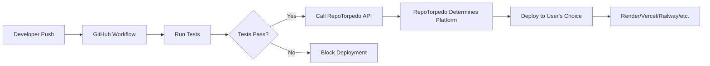

# 🚀 GitHub Workflows Guide for RepoTorpedo

## Overview

RepoTorpedo uses a **universal deployment approach** where GitHub workflows trigger the RepoTorpedo service, which then deploys to whatever platform the user has configured. This ensures **flexibility** and **user choice** rather than forcing specific deployment targets.

## 🔄 How It Works

### Old Approach (❌ Removed)

```yaml
# ❌ BAD: Hardcoded platform deployments
.github/workflows/vercel-deploy.yml  # Forces Vercel
.github/workflows/railway-deploy.yml # Forces Railway
```

**Problems:**

- Every user gets the same deployment targets
- No flexibility in platform choice
- Defeats RepoTorpedo's purpose as a universal tool

### New Approach (✅ Correct)

```yaml
# ✅ GOOD: Triggers RepoTorpedo service
.github/workflows/ci-cd.yml # Tests code, then calls RepoTorpedo API
```

**Benefits:**

- User chooses their preferred platform (Render, Vercel, Railway, etc.)
- RepoTorpedo orchestrates the deployment
- Single workflow works for all platforms

## 🏗️ Architecture Flow



## 📋 Workflow Configuration

### For RepoTorpedo Development

The main CI/CD workflow (`/.github/workflows/ci-cd.yml`) handles:

1. **Testing Phase:**

   - Backend tests (Python)
   - Frontend tests (React)
   - Code linting

2. **Deployment Phase:**
   - Triggers RepoTorpedo API
   - Sends repository metadata
   - Lets RepoTorpedo handle platform selection

### For User Projects

Users copy the template workflow to their repositories:

```bash
# Copy this file to user's repository
cp examples/user-workflow-template.yml .github/workflows/repotorpedo-deploy.yml
```

## 🔧 Required Secrets

### For Users

Users need to set these GitHub repository secrets:

```bash
REPOTORPEDO_TOKEN=your-api-token
# REPOTORPEDO_API_URL is hardcoded in the template
```

### For RepoTorpedo Development

```bash
REPOTORPEDO_API_URL=https://your-instance.com
REPOTORPEDO_TOKEN=development-token
```

## 🛠️ API Endpoints

### POST `/api/deploy`

**Purpose:** Receive deployment requests from GitHub workflows

**Payload:**

```json
{
  "repository": "https://github.com/user/repo",
  "branch": "main",
  "commit": "abc123...",
  "commit_message": "Fix bug in authentication",
  "author": "username",
  "trigger": "github_workflow"
}
```

**Response:**

```json
{
  "status": "success",
  "platform": "render",
  "deployment_result": {...},
  "triggered_by": "github_workflow"
}
```

### GET `/api/deployment-status`

**Purpose:** Check deployment progress

**Parameters:**

- `commit`: Git commit hash
- `repository`: Repository URL

**Response:**

```json
{
  "status": "completed",
  "platform": "render",
  "deployment_url": "https://your-app.render.com",
  "message": "Deployment completed successfully"
}
```

## 🎯 User Configuration

### Step 1: Platform Selection

Users configure their preferred deployment platform in RepoTorpedo's UI:

- ✅ Render
- ✅ Vercel
- ✅ Railway
- ✅ Netlify

### Step 2: Authentication

Users connect their platform accounts (API keys, OAuth, etc.)

### Step 3: Repository Setup

Users add the workflow template to their repository

### Step 4: Automatic Deployment

Every push to `main` triggers deployment to their chosen platform

## 🔍 Troubleshooting

### Common Issues

1. **"Configuration Required" Error**

   ```json
   {
     "status": "configuration_required",
     "message": "No deployment configuration found"
   }
   ```

   **Solution:** User needs to set up their deployment preferences in RepoTorpedo

2. **Authentication Errors**

   ```json
   {
     "status": "error",
     "message": "GitHub authentication required"
   }
   ```

   **Solution:** Check `REPOTORPEDO_TOKEN` secret

3. **Platform Not Supported**
   ```json
   {
     "status": "error",
     "message": "Unsupported platform: custom"
   }
   ```
   **Solution:** Use supported platforms or implement custom platform support

### Debug Steps

1. Check GitHub Actions logs
2. Verify secrets are set correctly
3. Test RepoTorpedo API manually:
   ```bash
   curl -X POST "https://your-instance.com/api/deploy" \
     -H "Authorization: Bearer YOUR_TOKEN" \
     -H "Content-Type: application/json" \
     -d '{"repository": "...", "branch": "main", "commit": "..."}'
   ```

## 🚀 Benefits of This Approach

### For Users

- **Choice:** Pick any supported platform
- **Flexibility:** Switch platforms without changing workflows
- **Simplicity:** One workflow for all projects

### For RepoTorpedo

- **Scalability:** Add new platforms without changing user workflows
- **Control:** Centralized deployment logic
- **Analytics:** Track all deployments through one API

### For Developers

- **Consistency:** Same deployment process across projects
- **Reliability:** Tested and proven workflow template
- **Visibility:** Clear deployment status and logs

## 📚 Next Steps

1. **Database Integration:** Store user deployment configurations
2. **Webhook Support:** Real-time deployment status updates
3. **Platform Expansion:** Add more deployment targets
4. **Advanced Features:** Rollback automation, blue-green deployments

---

**Need help?** Check our [documentation](./README.md) or [open an issue](https://github.com/your-repo/issues).
