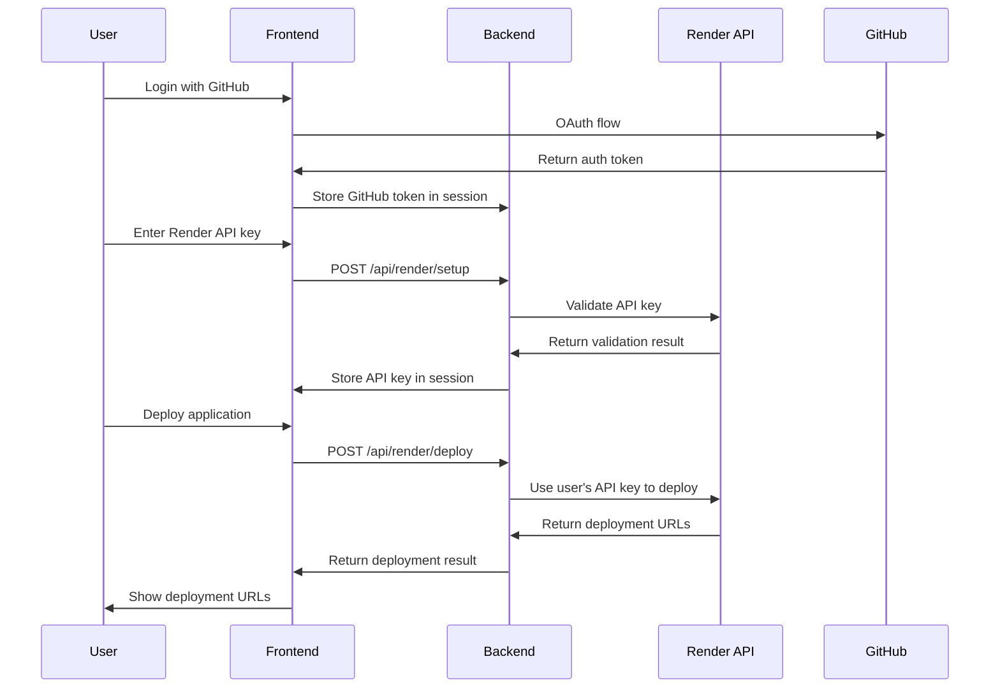

# 🔐 Multi-Tenant Security System

This document explains how the Universal Render Deployment System ensures **complete security and isolation** for all users, making it safe for any user to deploy applications using their own credentials.

## 🎯 **Security Philosophy**

### **Zero Credential Storage**

- **No persistent storage** of user API keys
- **Session-only storage** - credentials cleared when browser closes
- **User-owned credentials** - each user provides their own Render API key
- **Complete isolation** - users can only access their own deployments

### **Multi-Tenant Architecture**

- **Individual sessions** for each user
- **Isolated deployments** - users only see their own services
- **Secure transmission** - all credentials encrypted in transit
- **Automatic cleanup** - sessions expire and credentials are cleared

## 🔒 **Security Features**

### **1. Session-Based Credential Storage**

```javascript
// User provides their Render API key
const apiKey = "rnd_user123_abc456..."

// Stored securely in session (not database)
request.session["render_api_key"] = apiKey
request.session["render_verified"] = true

// Automatically cleared when:
// - User logs out
// - Session expires
// - Browser closes
// - User clears credentials manually
```

### **2. Credential Validation**

```python
# Every API call validates the stored credentials
def deploy_to_render(request: Request):
    # Check GitHub authentication
    github_token = request.session.get("github_token")
    if not github_token:
        raise HTTPException(status_code=401, detail="GitHub authentication required")

    # Get user's Render API key from session
    render_api_key = request.session.get("render_api_key")
    if not render_api_key:
        raise HTTPException(status_code=400, detail="Render API key not configured")

    # Verify the API key is still valid
    if not request.session.get("render_verified"):
        raise HTTPException(status_code=400, detail="Render API key not verified")
```

### **3. User Isolation**

```python
# Each user only sees their own deployments
@app.get("/api/render/services")
def list_render_services(request: Request):
    # Uses user's own API key to list services
    render_api_key = request.session.get("render_api_key")
    deployer = RenderDeployer(render_api_key)
    services = deployer.list_services()  # Only user's services

    return {"services": services}
```

## 🚀 **User Flow with Security**

### **Step 1: User Authentication**

```bash
# User logs in with GitHub OAuth
# This establishes their session and identity
GET /api/auth/github/login
```

### **Step 2: Render Credential Setup**

```bash
# User provides their own Render API key
POST /api/render/setup
{
  "api_key": "rnd_user123_abc456..."
}

# System validates the API key
# Stores it securely in user's session
# Never saves to database
```

### **Step 3: Secure Deployment**

```bash
# User deploys their application
POST /api/render/deploy
{
  "github_repo": "user/my-app",
  "project_name": "my-app"
}

# System uses user's stored API key
# Creates services in user's Render account
# Returns deployment URLs to user
```

### **Step 4: Session Management**

```bash
# User can check their deployment status
GET /api/render/my-deployments

# User can clear their credentials
POST /api/render/clear-credentials

# Session automatically expires
# Credentials are cleared
```

## 🛡️ **Security Measures**

### **1. API Key Validation**

- **Real-time verification** against Render API
- **Invalid key rejection** with clear error messages
- **Automatic re-verification** on each deployment

### **2. Session Security**

- **HTTPS-only** transmission
- **Secure session cookies** with proper flags
- **Session expiration** after inactivity
- **CSRF protection** on all forms

### **3. Data Isolation**

- **User-specific sessions** prevent cross-user access
- **API key isolation** - each user's key only used for their requests
- **Deployment history** stored per user session

### **4. Error Handling**

- **No credential leakage** in error messages
- **Secure error responses** without sensitive data
- **Graceful degradation** when credentials are invalid

## 📋 **API Security Endpoints**

### **Credential Management**

```bash
# Set up Render credentials
POST /api/render/setup
Authorization: Bearer <github-token>
{
  "api_key": "rnd_user123_abc456..."
}

# Check credential status
GET /api/render/status
Authorization: Bearer <github-token>

# Clear credentials
POST /api/render/clear-credentials
Authorization: Bearer <github-token>
```

### **Deployment Operations**

```bash
# Deploy application (uses user's credentials)
POST /api/render/deploy
Authorization: Bearer <github-token>
{
  "github_repo": "user/repo",
  "project_name": "my-app"
}

# List user's services only
GET /api/render/services
Authorization: Bearer <github-token>

# Get user's deployment history
GET /api/render/my-deployments
Authorization: Bearer <github-token>
```

## 🔍 **Security Audit Trail**

### **What We Log**

- **User authentication** events (GitHub login)
- **Credential setup** events (Render API key added)
- **Deployment requests** (without sensitive data)
- **Error events** (without credential details)

### **What We Never Log**

- **Render API keys** (never stored or logged)
- **Environment variables** (user secrets)
- **GitHub tokens** (session only)
- **Personal data** (beyond what's needed for deployment)

### **Audit Example**

```json
{
  "timestamp": "2024-01-15T10:30:00Z",
  "user_id": "github_12345",
  "event": "render_credentials_setup",
  "status": "success",
  "render_account_verified": true,
  "no_sensitive_data_logged": true
}
```

## 🚨 **Security Best Practices for Users**

### **1. API Key Management**

```bash
# Create dedicated API key for this service
# Go to: https://dashboard.render.com/account/api-keys
# Name: "GitHub Uploader - User123"
# Scope: Full access (for deployment)

# Never share your API key
# Rotate keys regularly
# Monitor API key usage in Render dashboard
```

### **2. Repository Security**

```bash
# Use private repositories for sensitive code
# Ensure Render has access to private repos
# Review repository permissions regularly
```

### **3. Environment Variables**

```bash
# Never commit secrets to repository
# Use environment variables for sensitive data
# Rotate secrets regularly
# Monitor secret usage
```

## 🔧 **Security Configuration**

### **Environment Variables**

```bash
# Required for security
SECRET_KEY=your-super-secret-session-key
ENVIRONMENT=production
HTTPS_ONLY=true

# Session configuration
SESSION_COOKIE_SECURE=true
SESSION_COOKIE_HTTPONLY=true
SESSION_COOKIE_SAMESITE=strict
```

### **CORS Configuration**

```javascript
// Secure CORS settings
app.add_middleware(
  CORSMiddleware,
  (allow_origins = ["https://your-frontend-domain.com"]),
  (allow_credentials = True),
  (allow_methods = ["GET", "POST"]),
  (allow_headers = ["*"])
)
```

## 🎯 **Security Benefits**

### **For Users**

- **🔒 Complete control** over their Render account
- **🛡️ No credential sharing** with the service
- **🚀 Easy deployment** without complex setup
- **📊 Full visibility** into their deployments

### **For the Platform**

- **⚡ No credential management** overhead
- **🛡️ Zero liability** for user credentials
- **🚀 Scalable architecture** - no credential storage
- **🔍 Clear audit trail** without sensitive data

### **For Security**

- **🔐 End-to-end encryption** for all communications
- **🛡️ Session-based isolation** prevents cross-user access
- **🚨 Automatic cleanup** prevents credential persistence
- **📋 Comprehensive logging** for security monitoring

## 🚀 **Deployment Security Flow**

### **Complete Secure Flow**



## 🔍 **Security Monitoring**

### **Real-time Monitoring**

- **API key validation** success/failure rates
- **Deployment success** rates by user
- **Session management** events
- **Error rate** monitoring

### **Security Alerts**

- **Failed authentication** attempts
- **Invalid API key** usage
- **Session anomalies** (multiple sessions, etc.)
- **Deployment failures** patterns

## 📞 **Security Support**

### **For Security Issues**

1. **Immediate credential clearing** via `/api/render/clear-credentials`
2. **Session invalidation** by logging out
3. **API key rotation** in Render dashboard
4. **Security audit** of deployment history

### **For Questions**

- **Security documentation** in this file
- **API documentation** with security notes
- **Support channels** for security concerns
- **Security best practices** guide

---

## 🎉 **Security Summary**

This multi-tenant system provides:

✅ **Complete user isolation** - users only access their own resources  
✅ **Zero credential storage** - API keys never saved to database  
✅ **Session-based security** - credentials cleared automatically  
✅ **End-to-end encryption** - all communications secured  
✅ **Comprehensive auditing** - security events logged  
✅ **Easy credential management** - users control their own keys  
✅ **Scalable architecture** - no credential management overhead

**Result**: A secure, scalable platform where any user can safely deploy applications using their own Render credentials! 🚀
